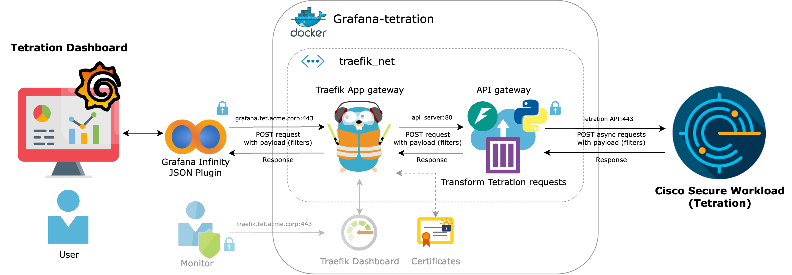

# tetration-grafana-public
API proxy for Tetration &amp; Grafana (Infinity plugin)

Cisco Secure Workload (also known as Tetration) has unfortunately lost the capability to create custom dashboards beyond version 3.6. This project was a critical customer requirement, aimed at integrating corporate Grafana with Tetration to ensure continued dashboard visibility on specific flows.

<picture>
  <source media="(prefers-color-scheme: dark)" srcset="Service_diagrams_b.png">
  <source media="(prefers-color-scheme: light)" srcset="Service_diagrams_w.png">
  
</picture>

In this repository, you will find a PDF containing detailed information regarding the specific use case.
